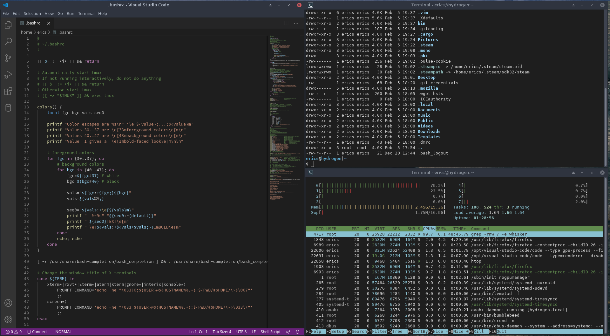

# XFCE-Terminal-VSCodeDark
An XFCE Terminal theme inspired by Visual Studio Code's Dark Theme

Works great with [tomasiser/vim-code-dark!](https://github.com/tomasiser/vim-code-dark)

# Installation
To install this theme to ~/.local/share/xfce4/terminal/colorschemes run 'install.sh'

# Screenshot

